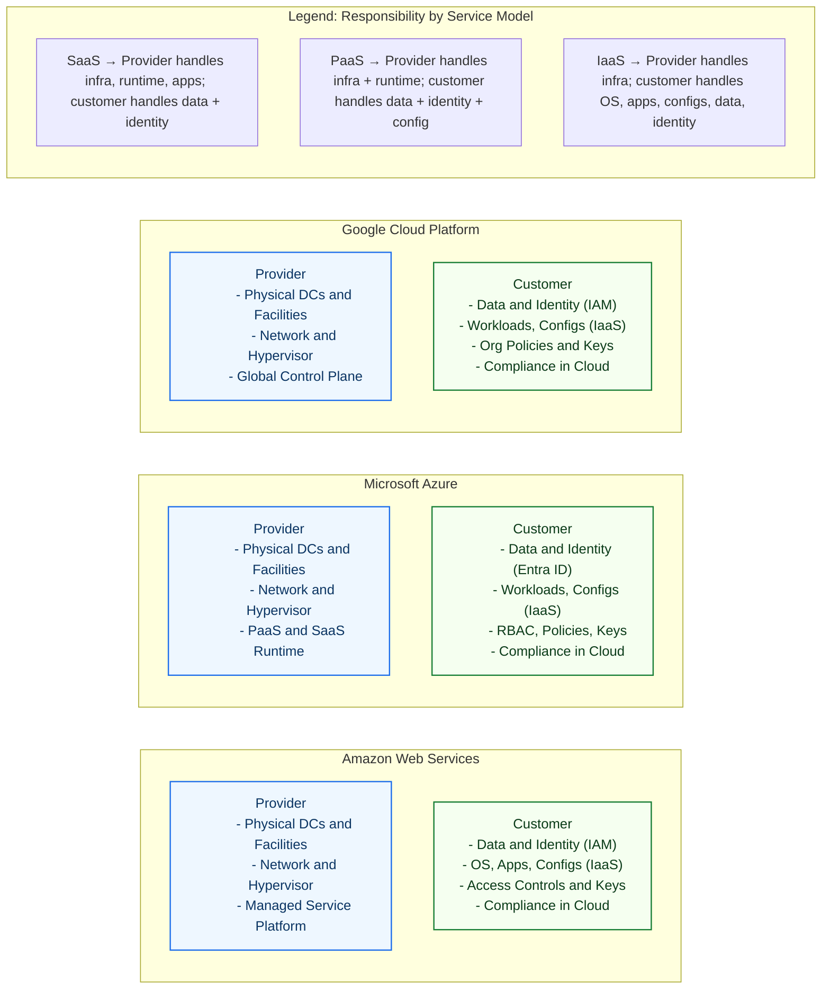

```mermaid
flowchart LR
    %% Shared Responsibility: Provider vs Customer (AWS, Azure, GCP)

    subgraph AWS[Amazon Web Services]
        AProv["Provider
        - Physical DCs and Facilities
        - Network and Hypervisor
        - Managed Service Platform"]:::prov
        ACust["Customer
        - Data and Identity (IAM)
        - OS, Apps, Configs (IaaS)
        - Access Controls and Keys
        - Compliance in Cloud"]:::cust
    end

    subgraph AZ[Microsoft Azure]
        ZProv["Provider
        - Physical DCs and Facilities
        - Network and Hypervisor
        - PaaS and SaaS Runtime"]:::prov
        ZCust["Customer
        - Data and Identity (Entra ID)
        - Workloads, Configs (IaaS)
        - RBAC, Policies, Keys
        - Compliance in Cloud"]:::cust
    end

    subgraph GCP[Google Cloud Platform]
        GProv["Provider
        - Physical DCs and Facilities
        - Network and Hypervisor
        - Global Control Plane"]:::prov
        GCust["Customer
        - Data and Identity (IAM)
        - Workloads, Configs (IaaS)
        - Org Policies and Keys
        - Compliance in Cloud"]:::cust
    end

    subgraph Legend[Legend: Responsibility by Service Model]
        L1["SaaS → Provider handles infra, runtime, apps; customer handles data + identity"]
        L2["PaaS → Provider handles infra + runtime; customer handles data + identity + config"]
        L3["IaaS → Provider handles infra; customer handles OS, apps, configs, data, identity"]
    end

    classDef prov fill:#eef7ff,stroke:#1f6feb,stroke-width:1.5px,color:#0b3563
    classDef cust fill:#f5fff0,stroke:#1a7f37,stroke-width:1.5px,color:#0b3b19
```
